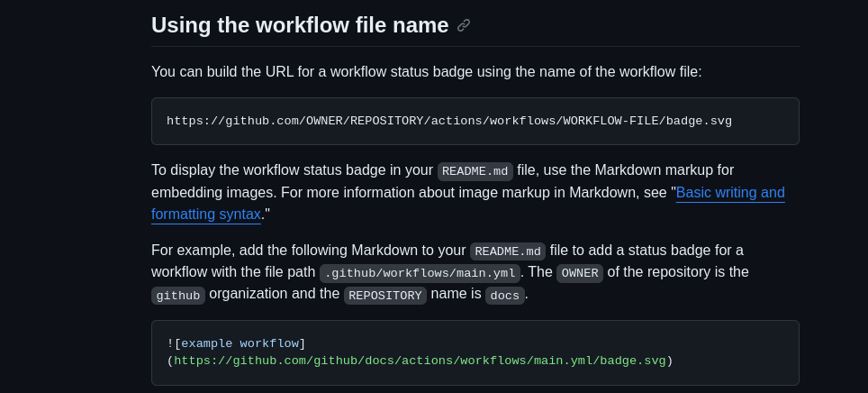
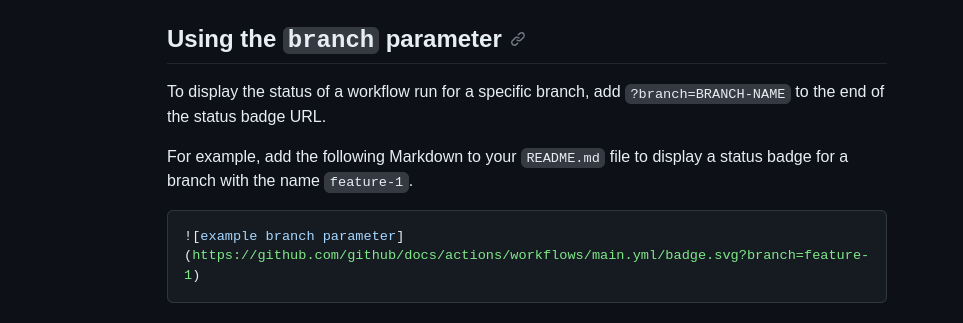
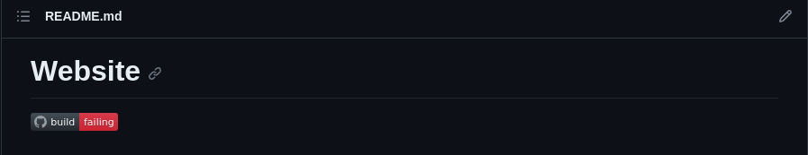
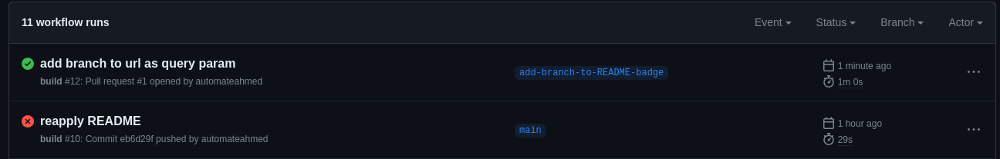
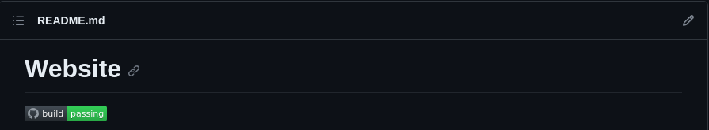

# Introduction

As part of building my website I required a simple continous integration workflow.

## Resources

- [Github actions adding a status badge](https://docs.github.com/en/actions/monitoring-and-troubleshooting-workflows/adding-a-workflow-status-badge)
- [Actions tab of the repository](https://github.com/automateahmed/website/actions)
- [Dotnet format](https://github.com/dotnet/format)

## Use case

- I want to build and test the application on each push
- I want to know the state of the latest push
- I am the single contributor so changes will be pushed directly to `main` 

## Setting up the default workflow

This was fairly simple to do. Under the `Actions` tab of the repository it allows you to generate a `yml` file, based on your need.
This website is a .NET 6 MVC application, so I chose the default .NET template.

This created a `.github` folder at the root of the repository and generated a `dotnet.yml` file [for me inside of it](https://github.com/automateahmed/website/commit/c997142e375b5b07d35b1a1532b04795b0d4bae8)

```yml
# This workflow will build a .NET project
# For more information see: https://docs.github.com/en/actions/automating-builds-and-tests/building-and-testing-net

name: .NET

on:
  push:
    branches: [ "main" ]
  pull_request:
    branches: [ "main" ]

jobs:
  build:
    runs-on: ubuntu-latest
    steps:
    - uses: actions/checkout@v3
    - name: Setup .NET
      uses: actions/setup-dotnet@v3
      with:
        dotnet-version: 6.0.x
    - name: Restore dependencies
      run: dotnet restore
    - name: Build
      run: dotnet build --no-restore
    - name: Test
      run: dotnet test --no-build --verbosity normal
```
It automatically ran the committed `dotnet.yml` which was great.

I also started using `dotnet format` which verifies your code formatting using the `.editorconfig` file checked in. As part of `.NET 6` it ships part of the SDK, this means there's no need for a `dotnet tool`.

So I added that in after [`build`]. The `--verify-no-changes` provides a failure exit code if formatting is needed.

```yml
- name: Verify code format
  run: dotnet format --verify-no-changes
```

This started [working immediately by failing the build](https://github.com/automateahmed/website/actions/runs/6517559952/job/17702159009) with the default project.

After formatting `dotnet format` [this build passed](https://github.com/automateahmed/website/actions/runs/6518206599/job/17703396240), and I now have a repository that builds, checks format and tests on each push to `main`

```md

~~I want to build and test the application on each push~~
I want to know the state of the latest push
```

## Adding a status badge

Within some [README's](https://github.com/automateahmed/website/blob/main/README.md) it's common to see a badge to indicate 

Using the GitHub actions documentation, there is a badge endpoint that you can point directly to.



Modifying this to the repository gave me the [badge](https://github.com/automateahmed/website/commit/2eea1f071a7f217e1be89caed6fe6426dd86e4ab) with a passing build.



It's important to check that a breaking build shows a broke badge. So I broke the [web build](https://github.com/automateahmed/website/commit/1b86313add4a16f6dbdc82c56fdff020d2aeb034), then viewed the badge, which [failed correctly](https://github.com/automateahmed/website/actions/runs/6523485361/job/17714172705) and the badge displayed as failing correctly



Although, I wanted to ensure this only showed `main`. Which the documentation shows adding the to the end of the url `branch={BRANCHNAME}` which will prevent it showing as failing if I decide to work on separate branches.

Pushing [this change](https://github.com/automateahmed/website/pull/1) on a PR, allowed me to check this badge only updated on `main`.



And no change happened to the badge, so it was working correctly to only fetch build status off `main`


With a [passing build](https://github.com/automateahmed/website/actions/runs/6523754827/job/17714706054) the badge returned to passing,

